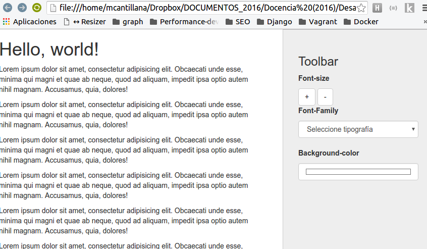
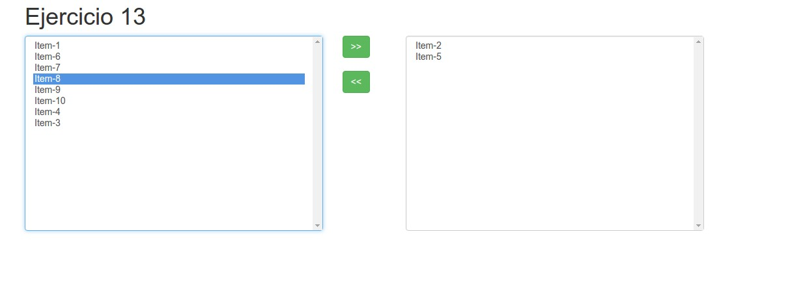

# Preguntas de Jquery
## Pregunta 1
El siguiente código debería reemplazar un elemento de la página, pero por algún motivo (o varios) no funciona, hay que arreglarlo.

```html
<!DOCTYPE html>
<html lang="en">
<head>
    <meta charset="UTF-8">
    <title>Ejercicio</title>
    <link rel="stylesheet" href="https://code.jquery.com/jquery-­‐2.2.1.min.js">
    <script src="prueba.js">
</head>
<body>
    <p id="p1">Hola</p>
</body>
</html>

```

```javascript
$(".p1").html("Nuevo parrafo")
```

HINT: utilizar el inspector de elementos y la consola de javascript del navegador.

## Pregunta 2

Se tiene el siguiente HTML 
```html
<!DOCTYPE html>
<html>
<head>
<script src="https://ajax.googleapis.com/ajax/libs/jquery/1.12.4/jquery.min.js"></script>

<style>
    .box {
        height:100px;
        width:500px;
        padding:10px;
        border:1px solid blue;
        background-color:lightblue;
    }

    .box p {
        background-color:pink;
    }
</style>

</head>
<body>

<div class="box">
This is a div element.
<p>This is a p element, in the div element. <br></p>
</div>

</body>
</html>
```

Se pide implementar una solución, que al hacer click en el div este cambio de color (El cambio de color debe ser aleatorio), pero esto no debe pasar cuando se haga click en los elementos que están dentro del div. 

Hint: Bubbling & Math.random()

## Pregunta 3
Se tiene la siguiente página web:

```html
<!DOCTYPE html>
<html lang="en">
<head>
    <meta charset="UTF-8">
    <title>Document</title>
    <link rel="stylesheet" href="http://code.jquery.com/jquery‐2.2.1.js">
</head>
<body>
    <ul>
        <li>1</li>
        <li>2</li>
        <li>3</li>
        <li>4</li>
        <li>5</li>
    </ul>
</body>
</html>
```

* Se pide agregar un botón a la página que al presionarlo agregue el elemento 6, luego el 7 y así sucesivamente.

* Se pide agregar un botón que elimine el primer elemento de la lista. (debe seguir con el conteo ascendente aunque se agregue al inicio de la lista)


## Pregunta 4
Se pide hacer un formulario web, que tenga un input, que permita ingresar un nombre, un input para ingresar un email y un dropdown que permite seleccionar el genero de un usuario.

Al hacer click en enviar se pide:
* Validar que el email no sea vacío
* Ingresar los datos dentro del objeto persona y acto seguido guardar este objeto dentro de un arreglo llamado personas


## Pregunta 5
Dado el siguiente HTML



Se pide crear las funcionalidades que permitan agrandar el tamaño de los parrafos del documento, cambiar la tipografía y color fondo.

El HTML base lo puedes descargar del siguiente [enlace](src/html/ejercicio5.html)


## Pregunta 6
Crear un documento HTML y cargar una imágen con la etiqueta img de HTML. Capturar los eventos de tecla para permitir mover la imagen utilizando las flechas de derecha e izquiera (La imagen se deberá poder mover 50px en la dirección respectiva)


## Pregunta 7
**Piedra, papel o tijera 2.0** 
Se pide resolver el juego piedra papel o tijera utilizando elementos visuales de HTML. Para ello se debe crear un select con las opciones piedra, papel o tijera y un botón que diga Jugar. El juego debe permitir jugar contra la computadora, quien generará su jugada de forma aleatoria.
Al momento de presionar el botón el programa debe entregar el resultado de quien fue el ganador.

## Pregunta 8
Utiliza los métodos focus() y blur() para cambiar el color de dos cuadros de texto cuando posicionamos el foco y cuando lo retiramos.

## Pregunta 9 
Crear un documento con un párrafo tal que aparezca un aviso alert() cuando se presiona el botón izquierdo del ratón.

## Pregunta 10
Utiliza el método hover() para lanzar un mensaje cuando nos posicionamos sobre un párrafo y otro cuando salgamos de él.

## Pregunta 11 
Crea una tabla de 8 filas, a continuación pon el fondo rojo a todas aquellas que estén por encima de la tercera (2) y pon el fondo azul a todas aquellas que estén por debajo de la tercera (2)

## Pregunta 12
Selecciona todos los párrafos de un documento que contengan “eu” y ponles un color de fondo rojo.


## Pregunta 13
Realiza un programa en JQuery para que en tu documento aparezcan 8 fotos en orden aleatorio.

## Pregunta 14

Se pide construir la siguiente interfaz, el objetivo es desarrollar las funcionalidades que permita agregar o eliminar elementos, es decir, mover los objetos de izquiera a derecha y viceversa.



Como base puede tomar el siguiente [HTML](src/html/ejericio14.html).